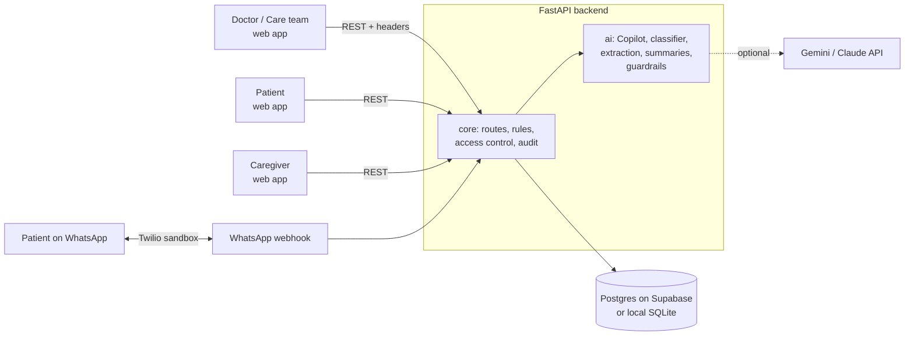

# OnKo — Cancer Care Companion

> **The doctor decides the care. OnKo makes sure the journey stays connected.**

OnKo is a longitudinal care-coordination prototype for cancer patients, their caregivers and their care teams. It turns a doctor's already-decided care plan into trackable daily activities, checks in with patients over WhatsApp, and brings what actually happened back to the care team as a clear, explainable attention queue.

**Team 404 Found** · Cancer Care (NCG) track · Long-term Care Engagement
Samprada Reddy · Niya Singh Shekhawat · Shreyan Samal · Clinical advisor: Dr. Sheelu S Reddy

## Live demo

| | Link |
|---|---|
| **Web app** |https://onko-cancer-care-companion.vercel.app/* |
| **Backend API** | https://onko-api.onrender.com |

The deployed demo is protected by an access code, shared with judges/reviewers on request. The backend runs on a free tier and may take up to a minute to wake up on the first request.

> ⚠️ **Prototype.** This build uses **fake demo patients only**. It is not cleared for real patient data: authentication is header-based for demo purposes, and production use would need real login, an encryption plan, DPDP Act–compliant consent flows and WhatsApp Business API approval.

---

## Contents
- [The problem](#the-problem)
- [Core principle and safety](#core-principle-and-safety)
- [Features](#features)
- [Architecture](#architecture)
- [Tech stack](#tech-stack)
- [Repository structure](#repository-structure)
- [Quick start (local)](#quick-start-local)
- [Environment variables](#environment-variables)
- [Demo identities](#demo-identities)
- [Running the demo](#running-the-demo)
- [Testing](#testing)
- [Deployment](#deployment)
- [Security and privacy](#security-and-privacy)
- [Team and workflow](#team-and-workflow)
- [Known limitations](#known-limitations)
- [Further documentation](#further-documentation)

---

## The problem

Between consultations, a cancer patient's care plan (medicines, cycles, tests, follow-ups) lives in prescriptions, phone calls and memory. Doses get missed, symptoms go unreported, reports pile up unreviewed, and the doctor walks into each consultation without a clear picture of what happened since the last one.

OnKo keeps that journey connected: **downstream of the doctor's decisions, never upstream of them.**

## Core principle and safety

**AI organizes, summarizes and structures. The clinician interprets and decides.**

| AI **may** | AI **must not** |
|---|---|
| Extract, organize, classify, summarize and route information already present in records, care plans and patient messages | Diagnose, judge clinical significance, recommend or change treatment, prescribe, calculate risk or predict prognosis |

How that is enforced in the code:

- **Approval gate.** Nothing the AI structures reaches a patient until the doctor reviews and approves it. Approval is refused if any item is missing a valid date.
- **No invented content.** The Care Plan Copilot drops any item, name or number that does not appear in the doctor's own text.
- **No interpretation of results.** Reports show values exactly as printed, e.g. `Hb: 9.2 g/dL — CBC, 20 Sep`, never "patient is anemic".
- **No risk scores.** The attention queue uses workflow labels (`SOS`, `NEEDS_REVIEW`, `QUERY`, `FOLLOW_UP`) with plain factual reasons.
- **Patient-declared SOS only.** The system never infers an emergency from symptoms.
- **Clinician-governed journey states.** Remission, relapse, palliative care and death are only ever set by a clinician.
- **Guardrail checks.** AI output is checked, not trusted: summaries containing interpretation, advice, severity or causation words are rejected and replaced by a rule-based fallback.
- **The demo never depends on the LLM.** Every AI feature has a rule-based path, so the app works with no API key or during an AI outage.
- **Audit trail.** Every approval, edit, escalation, consent change and assignment is recorded with who did it and the before/after values.

## Features

### Doctor and care team
- **Explainable attention queue**: patients surfaced with factual reasons (missed medication, unanswered check-ins, open queries, unreviewed reports, SOS), ordered SOS → Needs review → Query → Follow-up.
- **Care Plan Copilot**: the doctor types an already-decided plan in plain language; OnKo structures it into medications, treatments, investigations, appointments and milestones for review and approval. Recurrences ("BD for 14 days") expand into individual scheduled doses.
- **Patient 360**: one longitudinal view of the care plan, timeline, reports, queries, caregivers and attention history, with a factual **"Since your last review"** summary and a **pre-consultation brief**.
- **Team workspace**: assign attention items to nurses or junior doctors, hand off with an audit trail, and a "My items" view per team member.
- **Review actions**: mark a patient as reviewed, mark reports as reviewed; resolved items clear from the queue automatically.

### Patient
- **WhatsApp-native engagement**: one consolidated daily checklist instead of many reminders, with a 24-hour response window. Replies like `1 done, 2 missed` update the record.
- **Multilingual**: English, Hindi, Telugu and Tamil.
- **Queries**: questions and symptoms are classified, summarized factually and routed to the right queue, with no medical advice given back.
- **SOS**: a persistent patient-triggered SOS (app or WhatsApp) that goes to the top of the queue and alerts consented caregivers.
- **Longitudinal journey view** in the web app.

### Caregiver
- **Consent lifecycle**: invite → accept → revoke / re-invite, all audited. Caregivers can withdraw their own consent.
- **Minimized view**: caregivers see upcoming and recent activities only, with no doses, diagnosis, reports or queries (data minimization).
- **Permissions**: report upload and escalation alerts only when explicitly granted.

### Journey states

| State | Behaviour |
|---|---|
| Active treatment | Full support: checklist, reminders, attention rules |
| Remission / survivorship | History preserved, clinician-defined cadence |
| Relapse | Starts a **new journey chapter**; earlier history is kept, not reset |
| Transfer of care | Checklist paused; queries, reports and SOS still reach the team |
| Palliative | Adherence-style nudges suppressed; gentler wording; queries and SOS still work |
| Deceased | Hard stop on all automated messaging and new attention items |

## Architecture



The backend is one FastAPI app with three parts: **core** (data, rules, access control, audit), **ai** (structuring and summarizing with guardrails and rule-based fallbacks) and **whatsapp** (Twilio webhook, daily checklist, reply parsing). The frontend is a Next.js app with separate doctor, patient and caregiver areas.

## Tech stack

| Layer | Technology |
|---|---|
| Frontend | Next.js 14, React 18, TypeScript, Tailwind CSS |
| Backend | Python 3.12, FastAPI, SQLAlchemy 2 |
| Database | Supabase Postgres (Mumbai region) for the shared/deployed demo; SQLite for local dev and tests |
| AI | Google Gemini (or Anthropic Claude), always behind guardrails and rule-based fallbacks |
| Messaging | Twilio WhatsApp Sandbox |
| Hosting | Render (backend), Vercel (frontend) |
| Tests | pytest (400+ tests, including an end-to-end demo-flow test) |

## Repository structure

```
OnKo_CancerCareCompanion/
├── apps/
│   ├── api/                  # FastAPI backend
│   │   ├── main.py           # app entrypoint (shared)
│   │   ├── core/             # models, seed, routes, attention rules, journey states,
│   │   │                     # access control, consent, audit  (Samprada)
│   │   ├── ai/               # Copilot, classifier, extraction, summaries, guardrails  (Shreyan)
│   │   ├── whatsapp/         # Twilio webhook, daily checklist, reply parsing  (Shreyan)
│   │   ├── tests/            # pytest suite
│   │   └── requirements.txt
│   └── web/                  # Next.js frontend: doctor / patient / caregiver  (Niya)
├── contracts/                # API contract (api.md) and shared data shapes (schemas.json)
├── docs/
│   ├── core.md               # backend reference: rules, routes, identities, deployment
│   ├── ai.md                 # AI and WhatsApp reference
│   ├── web.md                # frontend notes
│   ├── DEMO_FLOW.md          # the demo script
│   └── WORKFLOW.md           # team git workflow
└── .env.example              # every environment variable, with comments
```

## Quick start (local)

**Requirements:** Git, Python 3.12, Node.js 18+.

### 1. Clone and configure
```bash
git clone https://github.com/SampradaReddy/OnKo_CancerCareCompanion.git
cd OnKo_CancerCareCompanion
cp .env.example .env            # Windows: copy .env.example .env
```
For local development keep `DATABASE_URL=sqlite:///./onko.db`. Add an AI key if you have one; everything also works without it.

### 2. Backend
```bash
cd apps/api
python -m venv .venv
source .venv/bin/activate        # Windows (PowerShell): .venv\Scripts\activate
pip install -r requirements.txt
python -m core.seed              # load the demo patients
uvicorn main:app --reload --port 8000
```
API docs: **http://localhost:8000/docs**

### 3. Frontend (new terminal)
```bash
cd apps/web
npm install
cp .env.local.example .env.local  # Windows: copy .env.local.example .env.local
```
In `apps/web/.env.local` set:
```
NEXT_PUBLIC_API_URL=http://localhost:8000
NEXT_PUBLIC_USE_MOCKS=false
```
Then:
```bash
npm run dev
```
App: **http://localhost:3000**

> **Windows PowerShell tip:** older PowerShell doesn't accept `&&`. Run commands one per line.

## Environment variables

All variables are listed in [`.env.example`](.env.example) with comments. The main ones:

| Variable | Purpose |
|---|---|
| `DATABASE_URL` | `sqlite:///./onko.db` locally, or the Supabase Session pooler URL (`postgresql+psycopg://...`) |
| `FRONTEND_ORIGIN` | Allowed frontend origin for CORS |
| `AI_PROVIDER` | `gemini` or `anthropic` |
| `GEMINI_API_KEY` / `GEMINI_MODEL` | Gemini key and model |
| `ANTHROPIC_API_KEY` / `AI_MODEL` | Claude key and model |
| `DEMO_ACCESS_CODE` | When set, every API call needs a matching `X-Access-Code` header |
| `DEMO_ROUTES_ENABLED` | `false` hides `POST /demo/reset` and `POST /demo/advance-day` |
| `TWILIO_ACCOUNT_SID` / `TWILIO_AUTH_TOKEN` / `TWILIO_WHATSAPP_FROM` | Twilio WhatsApp sandbox |
| `DEMO_PATIENT_WHATSAPP` / `DEMO_CAREGIVER_WHATSAPP` | Real phones (joined to the sandbox) for the demo patient and caregiver |
| `CRON_SECRET` | Lets a scheduler send the daily checklist |
| `PUBLIC_BASE_URL` | Public backend URL, used to verify Twilio signatures |

**Never commit `.env` and never paste keys or the access code into chats, issues or screenshots.** Share them only by direct message.

## Demo identities

Every API request sends `X-Role` and `X-User-Id` with a real seeded id (and `X-Access-Code` when the code is enabled).

| Role | Ids |
|---|---|
| Doctor | `doc_mehta` |
| Care team (nurse) | `nurse_anita` |
| Patients | `p_rajesh`, `p_priya`, `p_arjun`, `p_lakshmi`, `p_meera`, `p_vikram`, `p_farhan`, `p_kamala` |
| Caregivers | `cg_sunita`, `cg_karthik`, `cg_lakshmi`, `cg_harpreet`, `cg_ayesha`, `cg_suresh` |

The seed covers every journey state: e.g. **Meera** (palliative), **Vikram** (transfer of care), **Farhan** (relapse, chapter 2), **Kamala** (deceased). Full table with each patient's story: [`docs/core.md`](docs/core.md#3-demo-identities).

## Running the demo

The full script is in [`docs/DEMO_FLOW.md`](docs/DEMO_FLOW.md). In short:

1. **Doctor** types a plan into the Care Plan Copilot → OnKo structures it and flags missing dates → doctor fixes and **approves** → the patient's timeline fills in.
2. **Patient** gets the daily WhatsApp checklist → marks a dose missed → sends a symptom query.
3. **Doctor** sees the patient in the **attention queue** with factual reasons → opens **Patient 360** and the "since your last review" summary; lab values appear as recorded, with no interpretation.
4. **Patient** presses **SOS** → it jumps to the top of the queue and the consented caregiver is alerted.
5. **Journey states**: palliative mode softens messaging, transfer of care pauses the checklist, deceased stops everything.

Before a demo: run `POST /demo/reset` (doctor headers) to restore clean data, and open the deployed backend a minute early so the free server wakes up.

## Testing

```bash
cd apps/api
python -m pytest -q
```
The suite uses its own throwaway database with AI and Twilio keys blanked, so it never touches your demo data or sends real messages. It covers attention rules, recurrence, the approval gate, journey states, access control, caregiver consent, AI guardrails, WhatsApp parsing, deployment settings, and an **end-to-end test of the whole demo flow** (`tests/test_demo_flow.py`).

## Deployment

| Part | Where | Notes |
|---|---|---|
| Backend | Render web service | Root `apps/api`, build `pip install -r requirements.txt`, start `uvicorn main:app --host 0.0.0.0 --port $PORT`. Free tier sleeps after ~15 min idle. |
| Database | Supabase Postgres, Mumbai region | Use the **Session pooler** URL. Seed once with `python -m core.seed`. The database is shared, so resets affect everyone. |
| Frontend | Vercel | Root `apps/web`; set `NEXT_PUBLIC_API_URL` to the backend URL and `NEXT_PUBLIC_USE_MOCKS=false`. |
| WhatsApp | Twilio sandbox | Webhook: `https://<backend-url>/whatsapp/webhook`. Demo phones must send the sandbox `join <code>` message first, within 24 hours of the demo. |

On a public deployment set `DEMO_ACCESS_CODE` (shared by DM only) and `DEMO_ROUTES_ENABLED=false` outside of demo preparation. Full details: [`docs/core.md` → Deployment](docs/core.md#deployment).

## Security and privacy

- **Role- and ownership-based access**: patients see only their own data; caregivers only their minimized view, and only with consent; staff-only routes for queues, registries and audit.
- **Consent**: explicit, revocable caregiver consent with a full audit trail.
- **Data minimization**: each role sees only what its workflow needs.
- **Deployment hardening**: optional access code, Twilio signature verification, staff-only message sending, masked patient data in production logs.
- **Data residency**: the shared database runs in Supabase's Mumbai region.
- **Not production-ready**: header-based demo auth, no encryption plan, sandbox WhatsApp. See the prototype note at the top.

## Team and workflow

| Area | Owner |
|---|---|
| Backend core: data model, rules, attention queue, journey states, access control, consent, audit, deployment | **Samprada Reddy** |
| Frontend: doctor, patient and caregiver web app | **Niya Singh Shekhawat** |
| AI (Copilot, classification, extraction, summaries, guardrails) and WhatsApp | **Shreyan Samal** |
| Clinical guidance | **Dr. Sheelu S Reddy** |

**Branches:** `main` (demo-stable) ← `dev` (integration) ← personal branches (`samprada/core`, `niya/ui`, `shreyan/ai-wa`). All changes go through pull requests into `dev`. `contracts/` and `apps/api/main.py` are shared and changed only by team agreement. See [`docs/WORKFLOW.md`](docs/WORKFLOW.md).

## Known limitations

- Demo authentication is header-based, not real login.
- "Today" is computed in UTC.
- Attention rules for streaks, overdue queries and unreviewed reports run on `POST /demo/advance-day`; there is no background scheduler yet for those.
- After a relapse, events from the earlier plan stay scheduled until the doctor changes the plan (by design: OnKo doesn't decide care).
- The Twilio sandbox only messages phones that have joined it, within a 24-hour window, and shows sandbox branding.
- The free hosting tier sleeps when idle; the first request after a pause takes up to a minute.

## Further documentation

| Document | What's in it |
|---|---|
| [`docs/core.md`](docs/core.md) | Backend reference: routes, attention rules, journey states, approval gate, access control, consent, audit, deployment |
| [`docs/ai.md`](docs/ai.md) | AI design, guardrails and test cases, WhatsApp commands, Twilio setup |
| [`docs/web.md`](docs/web.md) | Frontend notes |
| [`docs/DEMO_FLOW.md`](docs/DEMO_FLOW.md) | The demo script |
| [`docs/WORKFLOW.md`](docs/WORKFLOW.md) | Team git workflow |
| [`contracts/api.md`](contracts/api.md) | API contract |
| [`contracts/schemas.json`](contracts/schemas.json) | Shared data shapes |
